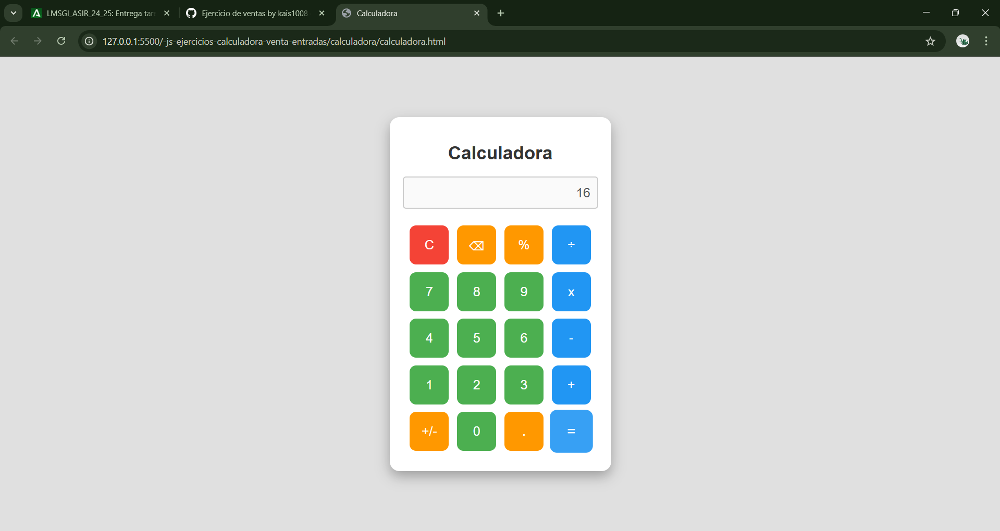
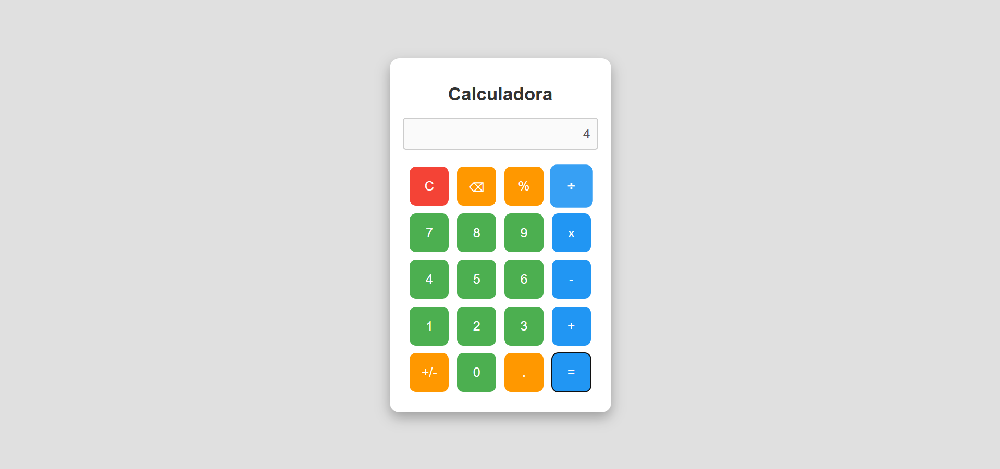
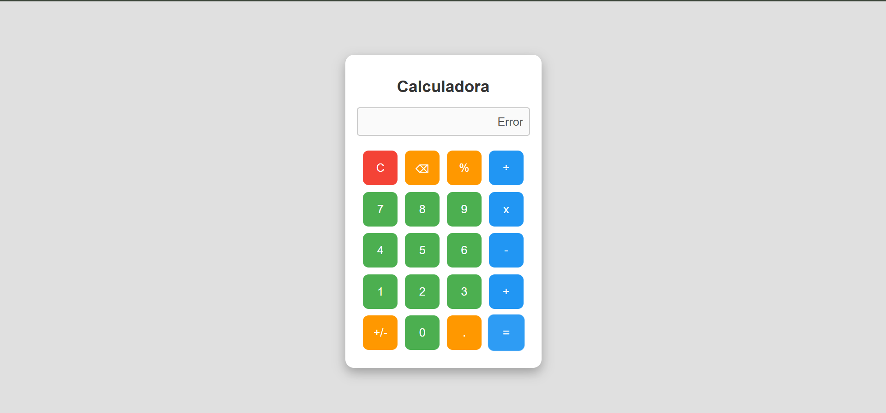
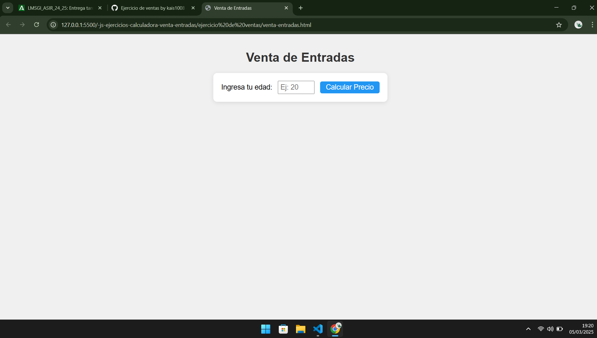
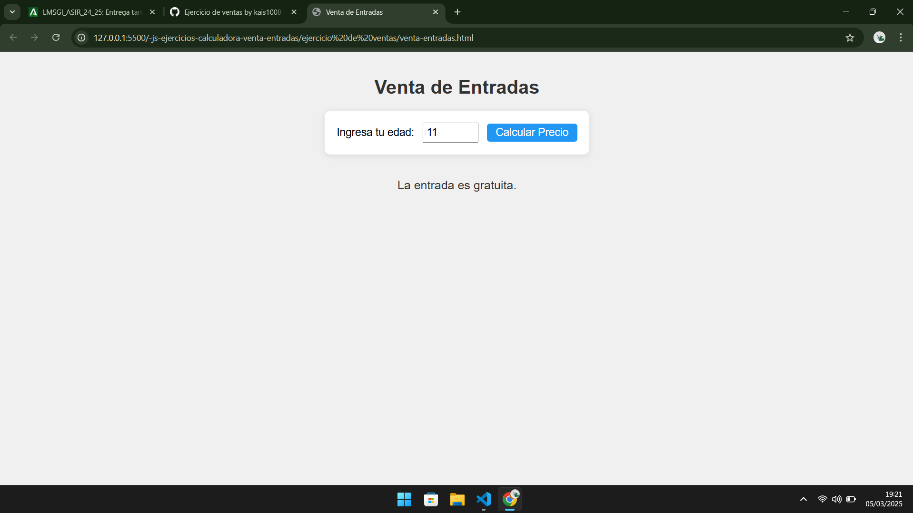
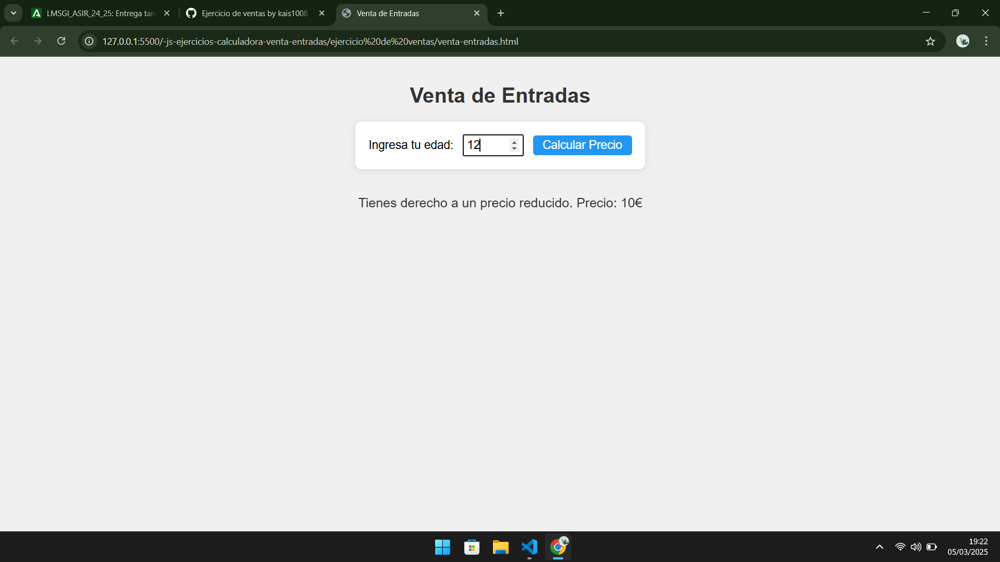
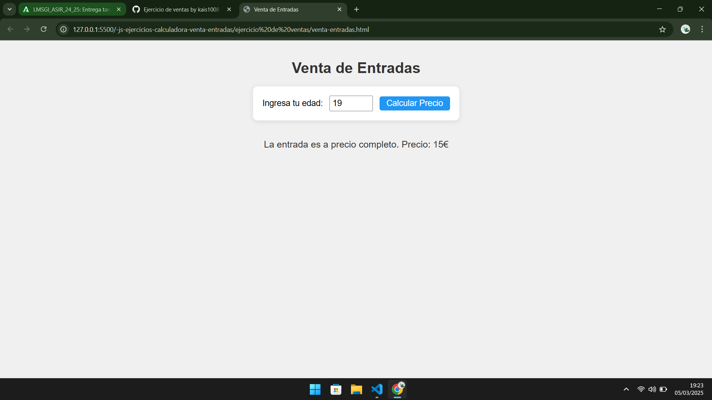

CALCULADORA

aqui tenemos el funcionamiento de la calculadora hemos sumado 8+8 y sale de resultado 16

cuando lo dividimos entre 4

como resultado nos devuelve 4

si dividimos cualquier numero entre 0 nos saldrá error

VENTAS

aqui aparece el inicio del ejercicio de ventas donde pide que se introduzca algun numero que equivalga al numero de edad, en este caso pone como ejemplo el numero 20

si la edad es menos de 12, la entrada sera gratuita

si es mayor de 12 valdrá 10 euros

y si es mayor de 18 el precio sera completo 

